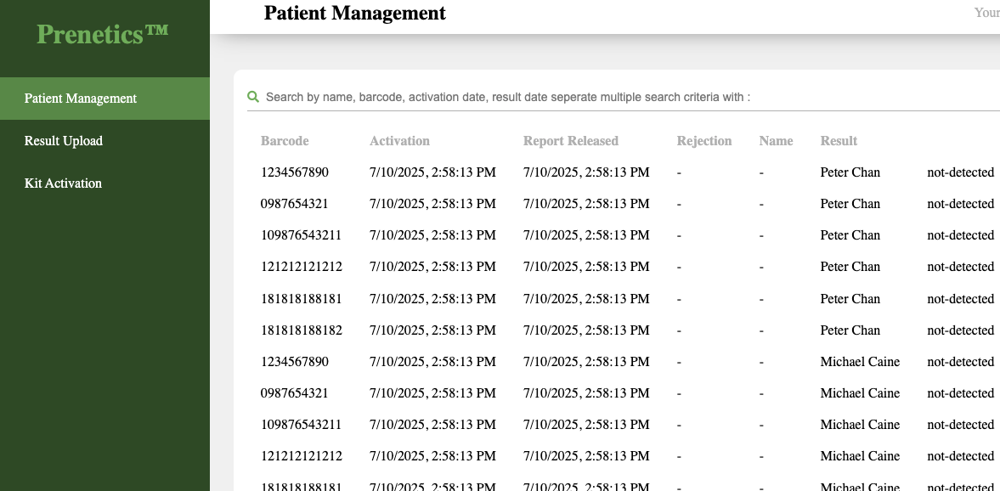
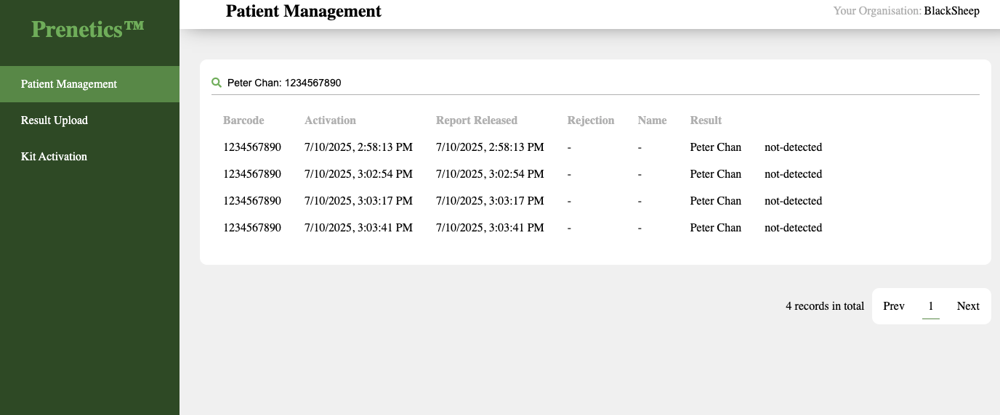
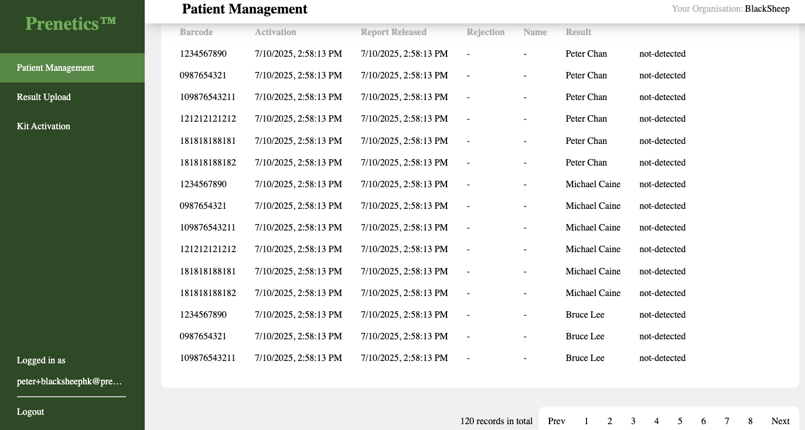

# Getting Started with Create React App
https://github.com/Prenetics/engineering/blob/main/fullstack.md

This project is a test application built with React. Follow the steps below to set up and run the application.

## Prerequisites
- **Node.js**: Ensure you have Node.js version 20 installed.

## Download Backend Service

1. Clone the backend repository:
   ``` 
   git clone https://github.com/mugeesh/prenetics-backend-assignment

Follow the instructions in the backend repository to run the service and check the API.

To retrieve the organization ID, run the following command:
1. Clone the backend repository:
   ```
   curl -X 'GET' 'http://localhost:8080/test/v1.0/org' -H 'accept: application/json'

Alternatively, you can access the Swagger documentation:
http://localhost:9080/swagger/#/

##### System Setup and run
1. node version 20
2. copy env to .env or create and paste this value
```
   REACT_APP_SEARCH_PLACEHOLDER=Search by name, barcode, activation date, result date separate multiple search criteria with :
   REACT_APP_API_BASEURL=http://localhost:8080/test/v1.0
   REACT_APP_ORGANISATION_ID=fd33629c-c1e8-43f4-86b7-b85396815616
   
1. Update REACT_APP_ORGANISATION_ID from backend step (1. curl http://localhost:8080/test/v1.0/org)
2. npm install
3. npm start
```
http://localhost:3000/


##### Screenshot
Landing page

Filter

Pagination

